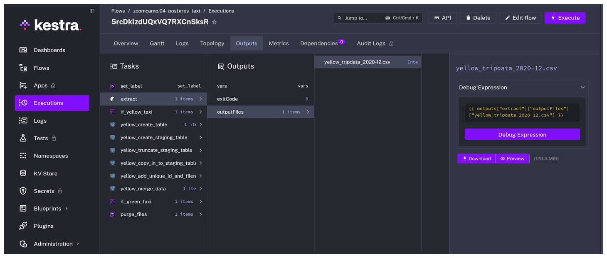
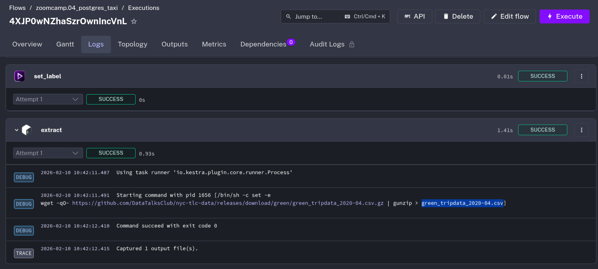
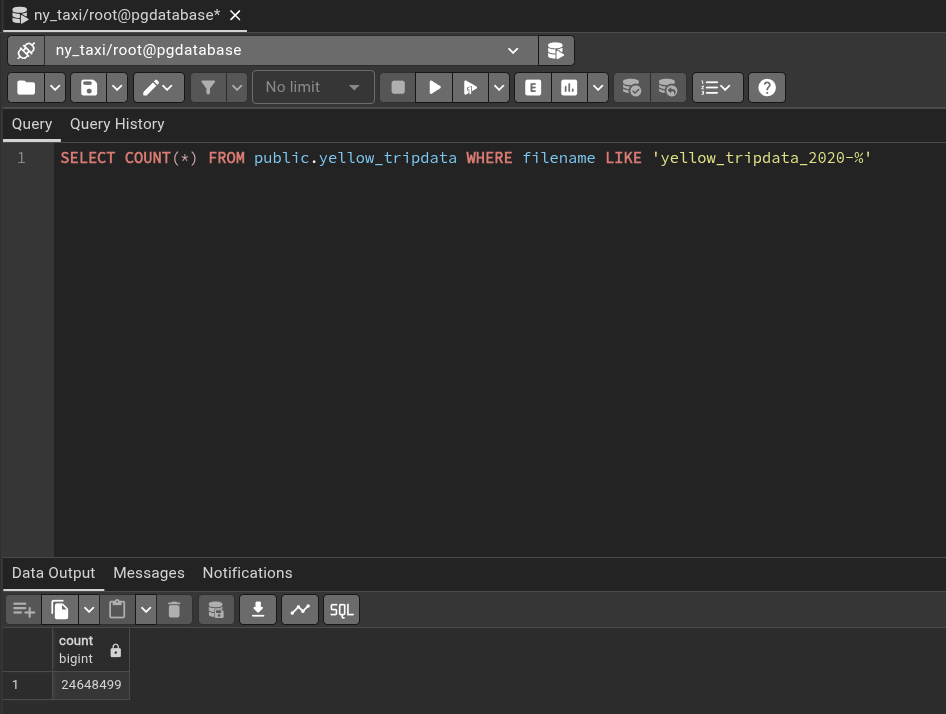
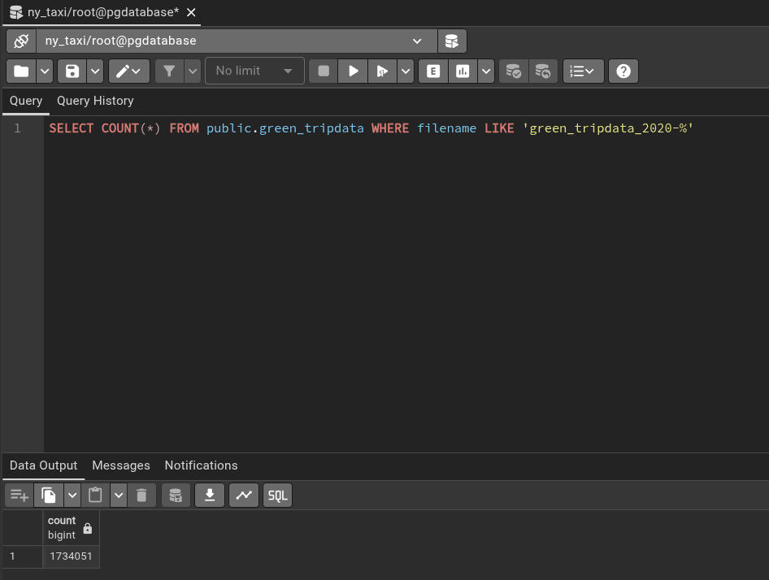
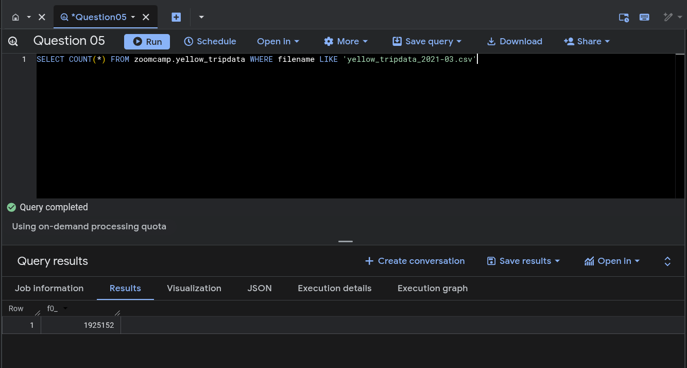
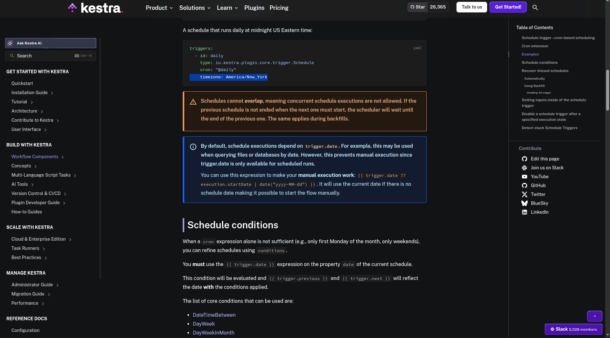

# Module 2: Workflow Orchestration with Kestra

## Data Engineering Zoomcamp - Quiz Answers

This document contains answers to the Module 2 Quiz with supporting evidence for each question.

---

### Question 1: Yellow Taxi Data File Size

Within the execution for Yellow Taxi data for the year 2020 and month 12: what is the uncompressed file size (i.e. the output file yellow_tripdata_2020-12.csv of the extract task)?

**Answer:** 128.3 MiB

---

### Question 2: Rendered Variable File Name

What is the rendered value of the variable file when the inputs taxi is set to green, year is set to 2020, and month is set to 04 during execution?

**Answer:** green_tripdata_2020-04.csv

---

### Question 3: Yellow Taxi Data Row Count (2020)

How many rows are there for the Yellow Taxi data for all CSV files in the year 2020?

**Answer:** 24,648,499

---

### Question 4: Green Taxi Data Row Count (2020)

How many rows are there for the Green Taxi data for all CSV files in the year 2020?

**Answer:** 1,734,051

---

### Question 5: Yellow Taxi Data Row Count (March 2021)

How many rows are there for the Yellow Taxi data for the March 2021 CSV file?

**Answer:** 1,925,152

---

### Question 6: Timezone Configuration

How would you configure the timezone to New York in a Schedule trigger?

**Answer:** Add a timezone property set to America/New_York in the Schedule trigger configuration

*Note: Answer verified according to official Kestra documentation.*

---